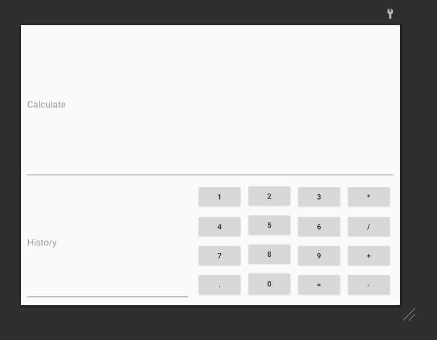
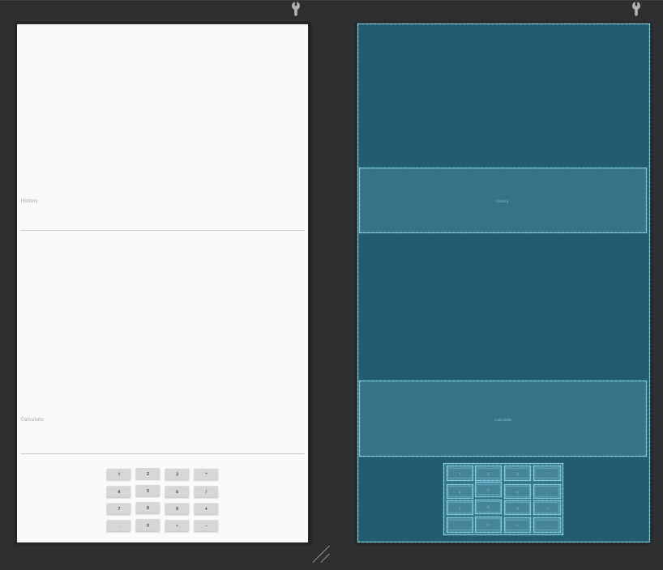
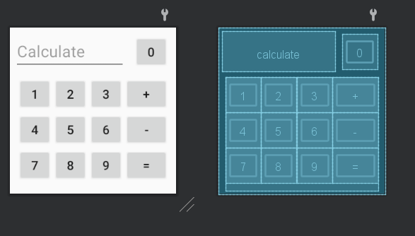
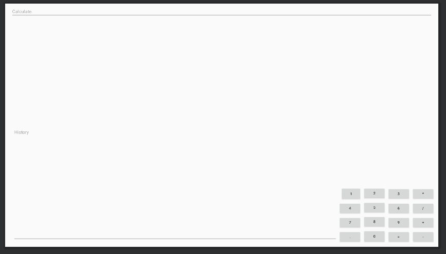

# ANDROID_3
## Content
Application is calculator. 

Features:
* Adapted to multiple layout sizes
* Handling multiple layouts and orientation(horizontal/vertical)
* Multiple buttons

## Screenshots

<!--  -->

## Resources
[Labolatory description[PL]](http://marek.piasecki.staff.iiar.pwr.wroc.pl/dydaktyka/pam-asi/laboratorium.html#ANDROID_3)

## Original assignment content

<table style="text-align: left; width: 600px;" border="1" cellpadding="10" cellspacing="0">

  <tbody>
    <tr style="font-family: Arial;">
      <td style="background-color: rgb(204, 204, 204);">Laboratorium (A3)&nbsp;
-&nbsp;
ANDROID -&nbsp; Ćwiczenia z projektowaniem "responsive" UI</td>
    </tr>
    <tr>
      <td>Oprogramuj
jednoekranową aplikację (single Activity app)
demonstrującą wykorzystanie komponentów dziedziczących po klasie View
(Layouts, Widgets) do skonstruowania interfejsu użytkownika, który
będzie się dynamicznie dopasowywał do: wielkości (small, normal, large, ... itd), rozdzielczości (ldpi, mdpi, ... itd) i
orientacji (port, land, square) wyświetlacza: <ol style="list-style-type: lower-alpha;">
        <li>Program demostrujący różne możliwości zmian
koloru/rozmiaru/typu czcionki tekstów wyświetlanych w etykietach lub
oknach edycyjnych, jako rezultat klikania na różnych przyciskach lub
wyboru różnych opcji menu. 
           
        </li>
        <li>Aplikacja standardowego kalkulatora arytmetycznego, z
zestawem klawiszy numerycznych oraz klawiszy podstawowych operacji
arytmentycznych (+,-,*,/).</li>
      </ol>Materiały pomocnicze: 

      
      <ul>
<li>TableLayout / <a href="http://www.techotopia.com/index.php/An_Android_6_TableLayout_and_TableRow_Tutorial">An Android TableLayout and TableRow Tutorial</a></li><li>GridLayout / <a href="http://www.techotopia.com/index.php/Using_the_Android_6_GridLayout_Manager_in_Android_Studio_Designer">Using the Android GridLayout Manager in Android Studio Designer</a></li><li>GridLayout / <a href="http://www.techotopia.com/index.php/Working_with_the_Android_6_GridLayout_using_XML_Layout_Resources">Working with the Android GridLayout using XML Layout Resources</a></li><li>ConstraintLayout / <a href="https://codelabs.developers.google.com/codelabs/constraint-layout/#0">Using ConstraintLayout to design your views</a> (Android 7, 2016) &nbsp; &nbsp; </li><li>Wskazówki - sposoby adaptacji kalkulatora do zmian wyświetlacza: - Building The UI Constraint Layout &nbsp;- &nbsp;<a href="http://www.i-programmer.info/programming/android/10063-android-adventures-building-the-ui-23-constraint-layout.html?start=3" target="_blank">Orientation And Resolution</a> - Building The UI Constraint Layout &nbsp;- &nbsp;<a href="http://www.i-programmer.info/programming/android/10063-android-adventures-building-the-ui-23-constraint-layout.html?start=4" target="_blank">A Calculator App example</a>&nbsp;  </li><li>Regularna siatka przycisków za pomocą: <table style="text-align: left; width: 100%;" border="1" cellpadding="10" cellspacing="0"><tbody><tr><td style="text-align: center;"><a href="http://marek.piasecki.staff.iiar.pwr.wroc.pl/dydaktyka/pam-asi/L03_AND/grid_with_TableLayout.xml">grid_with_Table Layout</a></td><td style="text-align: center;"><a href="http://marek.piasecki.staff.iiar.pwr.wroc.pl/dydaktyka/pam-asi/L03_AND/grid_with_GridLaout.xml">grid_with_GridLayout.xml</a></td></tr><tr><td style="text-align: center;"></td><td style="text-align: center;"></td></tr></tbody></table></li> 
      </ul>

      </td>
    </tr>
  </tbody>
</table>

