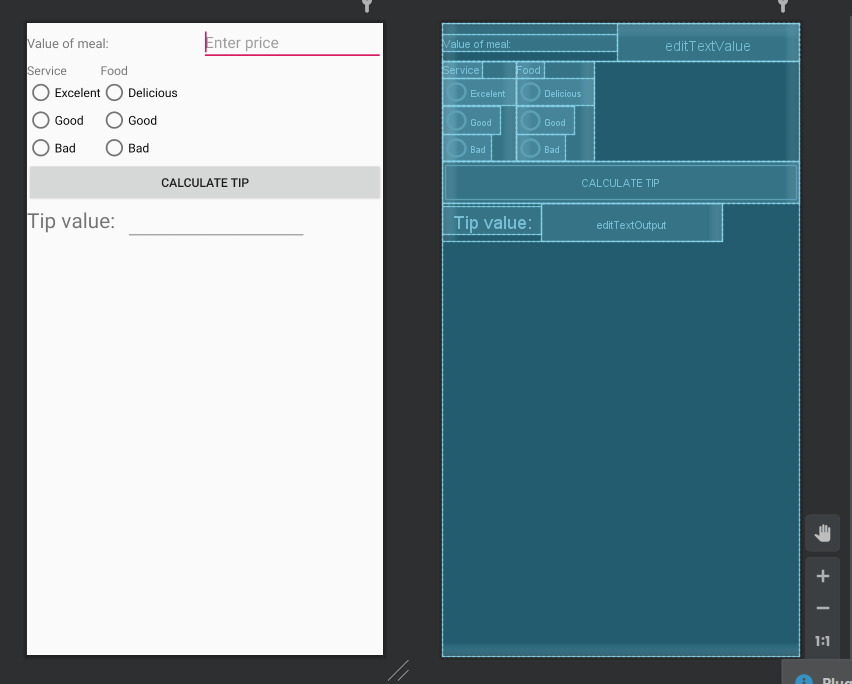

# ANDROID_2
## Content
Application is focused on User Interface elements. 

Handle properties and listeners for elements:
* Button
* EditText
* RadioGroup
* RadioButton

## Screenshots

<!--  -->

## Resources
[Labolatory description[PL]](http://marek.piasecki.staff.iiar.pwr.wroc.pl/dydaktyka/pam-asi/laboratorium.html#ANDROID_2)

## Original assignment content

&nbsp; 
<table style="text-align: left; width: 600px;" border="1" cellpadding="10" cellspacing="0">

  <tbody>
    <tr style="font-family: Arial;">
      <td style="background-color: rgb(204, 204, 204);">Laboratorium (A2)
&nbsp;
-&nbsp;&nbsp;
Implementacja aplikacji wykonującej proste obliczenia</td>
    </tr>
    <tr>
      <td>
      <ol style="list-style-type: lower-alpha;">
        <li>Wzorując się na wskazówkach:  
- z zestawu slajdów <a href="http://grail.cba.csuohio.edu/~matos/notes/cis-493/lecture-notes/slides/Android-Chapter01-Intro.pdf">Android
Devlopment Introduction</a>&nbsp; (ze stron nr: 32-39) 
- lub przykładowego kalkulatora
napiwku omówionego w <a href="http://marek.piasecki.staff.iiar.pwr.wroc.pl/dydaktyka/pam-asi/L02_AND/readings/Example_ChapterTwo.pdf">podrozdziale
nr 2.3.2</a> 
&nbsp;&nbsp; z
książki "Unlocking Android", 
napisz własny program
"Kalkulatora/Przelicznika kursu walut". Jako punkt startowy można
wykorzystać domyślny szablon Blank Activity 
           
        </li>
        <li>Wykorzystaj widok Android
Monitor (ikona narzędzi w lewym dolnym rogu), 
lub narzędzie / perspektywę DDMS
(Tools &gt; Android &gt; Android Device Monitor), 
oraz wydruki kontrolne
wykonywane w kodzie Java za pomocą&nbsp; poleceń: 
          Log.i(
"TAG",
"Tekst komunikatu"); 
do śledzenia działania programu i sygnalizowania błędów.</li>
      </ol>
Inne materiały pomocnicze: 
      <ul>
        <li>Techotopia / <a href="https://www.techotopia.com/index.php/A_Guide_to_the_Android_Studio_Designer_Tool_-_Android_6">8.
A Guide to the Android Studio Designer Tool</a></li>
        <li>Techotopia / <a href="https://www.techotopia.com/index.php/Designing_a_User_Interface_using_the_Android_Studio_Designer_Tool_-_Android_6">9.
Designing a User Interface using the Android Studio Designer Tool</a></li>
        <li>Techotopia / <a href="https://www.techotopia.com/index.php/Creating_an_Android_6_User_Interface_in_Java_Code">10.
Creating an Android 6 User Interface in Java Code</a></li>
        
      </ul>
      </td>
    </tr>
  </tbody>
</table>

