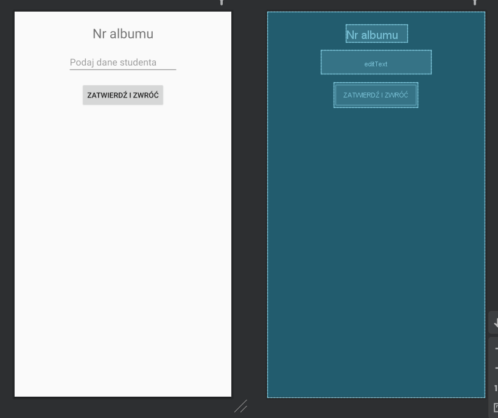
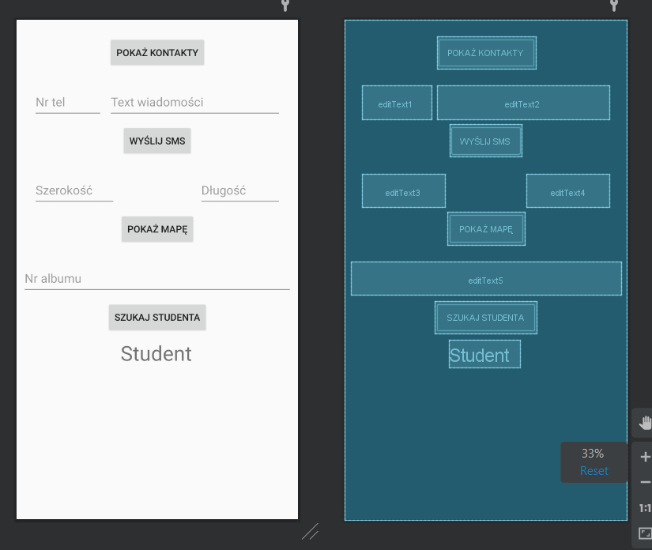

# ANDROID_4
## Content
Application major function is to create Intents and pass arguments between them. 

Features:
* Open different Intent's
  * contactsIntent
  * messagesIntent
  * mapsIntent
  * customIntent
* Sharing data content with Intents's
  * Bundle
  * startActivityForResult(customIntent, 1);

## Screenshots

<!--  -->

## Resources
[Labolatory description[PL]](http://marek.piasecki.staff.iiar.pwr.wroc.pl/dydaktyka/pam-asi/laboratorium.html#ANDROID_4)

## Original assignment content

<table style="text-align: left; width: 600px;" border="1" cellpadding="10" cellspacing="0">

  <tbody>
    <tr style="font-family: Arial;">
      <td style="background-color: rgb(204, 204, 204);">Laboratorium (A4)&nbsp;
-&nbsp;
ANDROID -&nbsp; aplikacje złożone z wielu okien/aktywności</td>
    </tr>
    <tr>
      <td>Oprogramuj złożoną wielo-okienkową aplikację, demonstrującą
wykorzystanie obiektów klasy Intent oraz
metody startActivity(...)
do uruchamiania własnych oraz wbudowanych aktywności systemu Android
(takich jak: Contacts, PhoneDialer, WebBrowser, GoogleMap). Klikanie
przycisków umieszczonych w głównym oknie/aktywności tego programu
powinno powodować:&nbsp; &nbsp;  
      <ol style="list-style-type: lower-alpha;">
        <li>Wyświetlenie listy kontaktów zapisanych w telefonie (a w
wersji zaawansowanej: wybór jednego z kontaktów). 
        </li>
        <li>Napisanie wiadomości SMS, której treść oraz odbiorca (numer
telefonu) będą wprowadzane za pomocą dwóch pól EditText.</li>
        <li>Wyświetlenie mapy (GoogleMap) dla miejsca, którego
współrzędne geograficzne tzn. długość i szerokość geograficzna będą
wprowadzane w polach EditText. 
        </li>
      </ol>
Przykładowe instrukcje takich wywołań startActivity
można znależć w prezentacji <a href="http://grail.cba.csuohio.edu/~matos/notes/cis-493/lecture-notes/slides/Android-Chapter10-Intents.pdf">Android
Intents</a>
na
stronach nr: 10-26. 
      <ol start="4" style="list-style-type: lower-alpha;">
        <li>Ostatni przycisk powinien uruchamiać nową dodatkową
aktywność, w całości napisaną przez studenta, za pomocą metody startActivityForResult(...). 
Aktywność ta będzie otrzymywać
parametry z okna głównego (a po zakończeniu działania zwracać wynik) w
obiekcie klasy Bundle.</li>
      </ol>
Wykorzystanie obiektów klasy Bundle do
przekazywania argumentów jest
omówione w wyżej wymienionej prezentacji na stronach nr 44-48,
a przykładowa aplikacja realizująca funkcjonalność sumowania dwóch
otrzymanych liczb (Example 17), jest zaprezentowana na stronach od 49
do 60.&nbsp;&nbsp;  
      
Inne materiały pomocnicze: Tutorial na temat Intencji oraz Aktywności w systemie Android (aut. Lars Vogel): 
&nbsp; -&nbsp; <a href="http://www.vogella.com/tutorials/AndroidIntent/article.html">Android
Intents - Tutorial 
      </a>Rozdziały z podręcznika online "<a href="http://www.techotopia.com/index.php/Android_Studio_Development_Essentials_-_Android_6_Edition">Android
Studio Development Essentials</a> (Techotopia) 
&nbsp; - 28 - <a href="http://www.techotopia.com/index.php/An_Overview_of_Android_6_Intents" title="An Overview of Android 6 Intents">An Overview of Android 6
Intents</a> 
&nbsp; - 29 - <a href="http://www.techotopia.com/index.php/Android_6_Explicit_Intents_%E2%80%93_A_Worked_Example" title="Android 6 Explicit Intents – A Worked Example">Android 6
Explicit Intents</a> 
&nbsp; - 30 - <a href="http://www.techotopia.com/index.php/Android_6_Implicit_Intents_%E2%80%93_A_Worked_Example" title="Android 6 Implicit Intents – A Worked Example">Android 6
Implicit Intents</a> 
Zmiany w systemie nadawania uprawnień (od API Level 23 - Android 6.0) 
&nbsp; - <a href="http://developer.android.com/training/permissions/requesting.html">Requesting
Permissions at Run Time</a>  
      </td>
    </tr>
  </tbody>
</table>

