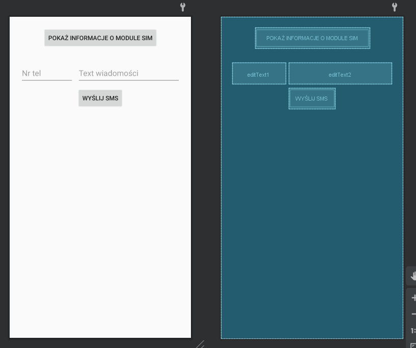

# ANDROID_5
## Content
Application is SIM module handler. 

Features:
* SIM module handle
  * SMS send 
  * SMS receive
* Permission that allows to connect to SIM module
## Screenshots

<!--  -->

## Resources
[Labolatory description[PL]](http://marek.piasecki.staff.iiar.pwr.wroc.pl/dydaktyka/pam-asi/laboratorium.html#ANDROID_5)

## Original assignment content

<table style="text-align: left; width: 600px;" border="1" cellpadding="10" cellspacing="0">

  <tbody>
    <tr style="font-family: Arial;">
      <td style="background-color: rgb(204, 204, 204);">Laboratorium (A5)&nbsp;
-&nbsp;&nbsp;
Przesyłanie danych poprzez SMS/MMS (Telephony API)</td>
    </tr>
    <tr>
      <td>Napisz aplikację "TelephonyDemo", która zademonstruje jak
należy oprogramować następujące funkcjonalności:
      <ol style="list-style-type: lower-alpha;">
        <li>Odczyt podstawowych informacji o parametrach i stanie
modułu telefonii 
(CallState,
PhoneType, NetworkType, subscriber
SIM ID, itp)&nbsp;  
          dokumentacja:&nbsp;
[Listing 7.1]&nbsp; oraz&nbsp; <a href="http://developer.android.com/reference/android/telephony/TelephonyManager.html">android.telephony.TelephonyManager</a>
           </li>
        <li>Blokowanie połączeń wychodzących (dla wybranych numerów)  
           dokumentacja:&nbsp; [Listing 7.6] 
           </li>
        <li>Programowa
obsługa przychodzących wiadomości SMS oraz automatyczne wysyłanie
odpowiedzi (np. danych personalnych odbiorcy i jego aktualnej
geo-pozycji). 
           dokumentacja:&nbsp; [Listing 7.7 and
7.8] ,&nbsp; <a href="http://developer.android.com/reference/android/telephony/SmsManager.html">android.telephony.SmsManager</a> 
           </li>
        <li>Monitorowanie zmian stanu kanału łącza głosowego oraz
transmisji danych 
(np. dostępności Internetu czy zmian mocy/jakości sygnału GSM) 
           dokumentacja:&nbsp; [Listing 7.2] ,&nbsp;
          <a href="http://developer.android.com/reference/android/telephony/PhoneStateListener.html">android.telephony.PhoneStateListener</a>
           
          </li>
      </ol>
Materiały pomocnicze: 
&nbsp; - <a href="http://marek.piasecki.staff.iiar.pwr.wroc.pl/dydaktyka/pam-asi/AND/Chapter_7_Telephony_API.pdf">Chapter
7. Telephony API</a>&nbsp; - przykładowy rozdział z podręcznika
"Android in
Action" 
&nbsp; - <a href="http://developer.android.com/training/permissions/requesting.html">Requesting
Permissions at Run Time</a> - jak rozwiązać problem odmowy uprawnień  
&nbsp;&nbsp;&nbsp; (permission denied error) gdy targetSdkVersion jest
23 lub nowsze.  &nbsp; - przykładowy tutorial &nbsp;<a href="https://android.jlelse.eu/detecting-sending-sms-on-android-8a154562597f" target="_blank">Detecting &amp; sending SMS on Android</a> &nbsp;(2018 - zaktualizowany &nbsp; &nbsp; &nbsp;do nowej polityki uprawnień i nowej obsługi odbierania SMS) 
      </td>
    </tr>
  </tbody>
</table>

